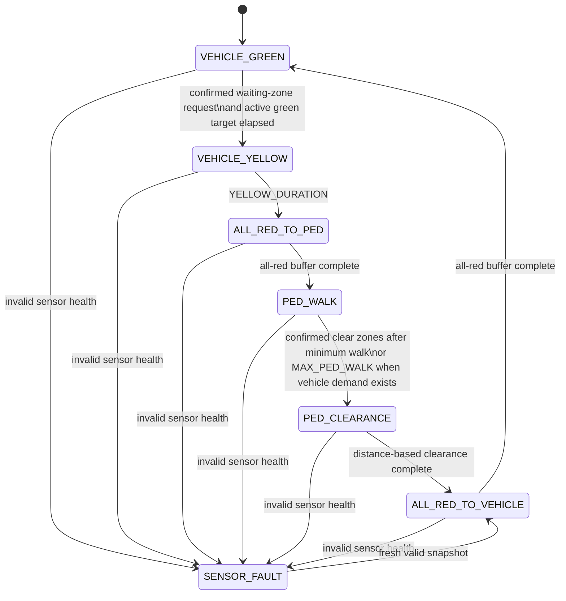

# Smart Traffic Light

A software-focused, full-stack traffic-light simulation for a portfolio and classroom demonstration. A Python state machine owns every control decision; the React interface only displays state and sends simulated sensor inputs.

> **Educational prototype only.** This project is not a certified traffic controller and must not be used on public roads. Every timing value and fallback policy below is for demonstration and requires design, hazard analysis, verification, and approval by qualified traffic-safety professionals before any real-world use.

## What the simulation demonstrates

- Two independent vehicle queues that discharge while the vehicle signal is green.
- A waiting zone that is the only source of pedestrian requests.
- A crosswalk zone that prevents an early end to the walk phase.
- Confirmed presence/absence timers that reject a single noisy detection frame.
- Distance-based pedestrian clearance with flashing `DONT_WALK`.
- A configurable fail-safe simulation policy for missing, unavailable, or stale sensor data.
- Flashing-yellow vehicle and disabled pedestrian signals during `SENSOR_FAULT`, followed by an all-red recovery buffer before vehicle green.

The camera/YOLO proof of concept remains in `backend/main.py`. It is not imported by the simulation API, so starting the web version does not open a camera or download a model.

## Quick start

Python 3 and npm are the only prerequisites. From the repository root, run:

```bash
./run.sh
```

The script automatically:

- Creates and activates `backend/.venv` if it does not exist.
- Installs the backend packages from `backend/requirements.txt`.
- Installs the frontend packages from `frontend/package.json` and `frontend/package-lock.json`.
- Starts FastAPI at `http://127.0.0.1:8000` and Vite at `http://127.0.0.1:5173`.

Open `http://127.0.0.1:5173`, and press `Ctrl+C` in the terminal to stop both servers. Dependency installation is safe to run again, so the same command can be used after pulling dependency updates.

## Architecture

```text
React presentation layer
  └── typed /api client + 350 ms polling
        └── FastAPI routes
              └── SimulationService (entities, queues, movement)
                    ├── SimulationSensorAdapter
                    │     └── zone-aware SensorSnapshot
                    └── pure StateMachine (all control decisions)
```

Key backend modules:

- `backend/app/config.py` — one immutable configuration object.
- `backend/app/models.py` — phase, signal, controller-state, and zone-aware sensor models.
- `backend/app/state_machine.py` — framework-independent control domain using externally supplied monotonic time.
- `backend/app/simulation.py` — first sensor adapter, queued entities, movement, and thread-safe orchestration.
- `backend/app/api.py` — request validation and HTTP routes only.

The `SensorAdapter` protocol is the seam for a future camera adapter. A camera implementation should convert detections into `vehicle_queue_by_lane`, `people_waiting_zone`, `people_on_crosswalk`, and `people_outside_zones`; it should not add control rules or change the state machine.

## State transitions



`PED_CLEARANCE` is the top-level clearance phase. Flashing is a pedestrian-signal behavior (`FLASHING_DONT_WALK`), never a separate `FLASHING` phase.

## Run the backend manually

Python 3.14.7 is supported and used for verification.

```bash
cd backend
python -m venv .venv
source .venv/bin/activate          # Windows: .venv\Scripts\activate
python -m pip install -r requirements.txt
uvicorn app.api:app --reload --host 127.0.0.1 --port 8000
```

OpenAPI documentation is available at `http://127.0.0.1:8000/docs`.

`requirements.txt` intentionally contains only the web-simulation dependencies.
This keeps the API lightweight and prevents camera/ML packages from being installed
for a server that never imports them.

The preserved camera/YOLO prototype has a separate, optional dependency set:

```bash
python -m pip install -r requirements-vision.txt
python main.py
```

The vision file uses a Python 3.14-compatible PyTorch pair (`torch 2.10` and
`torchvision 0.25`). It is outside the web-simulation runtime and is not needed
to run the portfolio milestone.

## Run the frontend manually

In a second terminal:

```bash
cd frontend
npm install
npm run dev
```

Open the URL printed by Vite (normally `http://127.0.0.1:5173`). The Vite proxy forwards the single `/api` base path to FastAPI at `127.0.0.1:8000`.

## API

| Method | Endpoint | Purpose / example body |
| --- | --- | --- |
| `GET` | `/api/health` | Service health |
| `GET` | `/api/state` | Current controller, timer, queues, zones, and sensor state |
| `POST` | `/api/simulation/vehicles` | `{"lane": 1, "count": 1}` |
| `POST` | `/api/simulation/pedestrians` | `{"zone": "waiting_left", "count": 1}` |
| `POST` | `/api/simulation/sensor` | `{"available": false}` or `{"available": true}` |
| `POST` | `/api/simulation/reset` | Reset controller, queues, people, and sensor |

## Configuration

All values live in `backend/app/config.py` as `TrafficConfig`.

| Setting | Default | Meaning |
| --- | ---: | --- |
| `MIN_GREEN` | 5 s | Base duration for each fixed vehicle-green service window |
| `MAX_GREEN` | 20 s | Hard upper bound for the active green window |
| `TIME_PER_VEHICLE` | 1 s | Service time per starting vehicle; also the simulated vehicle discharge interval |
| `PERSON_CONFIRM` | 1.5 s | Continuous waiting-zone presence required |
| `NO_PERSON_CONFIRM` | 1.5 s | Continuous empty controlled zones required |
| `YELLOW_DURATION` | 3 s | Fixed vehicle yellow interval |
| `ALL_RED_TO_PED_DURATION` | 1 s | Buffer before pedestrian walk |
| `ALL_RED_TO_VEHICLE_DURATION` | 1 s | Buffer before vehicle green |
| `MIN_PED_WALK` | 4 s | Minimum pedestrian walk interval |
| `MAX_PED_WALK` | 30 s | Ends an occupied walk phase when vehicle demand exists; otherwise walk remains active until a car arrives |
| `CROSSWALK_DISTANCE_M` | 6 m | Crossing distance used for clearance |
| `WALKING_SPEED_MPS` | 1.0 m/s | Demonstration walking speed |
| `FLASH_INTERVAL` | 0.5 s | Pedestrian clearance flash cadence |
| `SENSOR_MAX_AGE` | 2 s | Maximum sensor snapshot age |
| `PEDESTRIAN_ENTRY_DELAY` | 1.5 s | Waiting-zone delay before a newly added pedestrian enters an active walk phase |

Target green is calculated as:

```text
clamp(total_vehicle_queue × TIME_PER_VEHICLE, MIN_GREEN, MAX_GREEN)
```

The initial target is captured when the controller enters `VEHICLE_GREEN`. If more cars arrive, the target grows only enough to serve the remaining queue at the one-second discharge rate. Small and medium arrivals can therefore pass during the active green, while the twenty-second maximum is a hard cap that prevents a large or continuous queue from indefinitely delaying a confirmed pedestrian request. The target never shrinks during a green phase.

Pedestrian clearance is independent of pedestrian count:

```text
ceil(CROSSWALK_DISTANCE_M / WALKING_SPEED_MPS)
```

The simulation's configurable sensor-fault fallback is vehicle `FLASHING_YELLOW`, pedestrian `OFF`, and frozen vehicle/pedestrian movement. This is a project policy for demonstrating fault handling, **not a universal or standards-based public-road policy**.

## Demo walkthrough

1. Start both servers and open the dashboard.
2. Add several vehicles to each lane. The vehicle-green target starts from the initial queue and can grow for new arrivals, but never beyond `MAX_GREEN`; waiting vehicles leave while green.
3. Add a pedestrian. The backend confirms continuous waiting-zone presence, then waits for the active green target to finish before changing the signal.
4. Watch the exact sequence `VEHICLE_YELLOW → ALL_RED_TO_PED → PED_WALK`.
5. Observe the person move from the waiting zone to the crosswalk. The backend eventually enters `PED_CLEARANCE`, where the pedestrian signal flashes `DONT_WALK` for the distance-based duration.
6. Select **Simulate fault**. Both signals use the fallback and all movement freezes.
7. Select **Restore sensor**. The controller enters `ALL_RED_TO_VEHICLE` before returning to green.
8. Select **Reset simulation** to clear every entity and restore the initial state.

## Verification

Run the deterministic backend tests:

```bash
cd backend
python -m pytest -q
```

Run frontend checks:

```bash
cd frontend
npm run lint
npm run build
```

The unit tests inject time rather than sleeping. They cover confirmation timing, zone semantics, mandatory yellow/all-red phases, distance-based clearance, bounded green calculation, stale/unavailable sensors, safe recovery, entity movement, and reset.

## Scope

This milestone intentionally does not connect GPIO, a Raspberry Pi, IoT services, or physical signals. It also does not merge or modify competition-history branches. Those would require separate safety requirements and acceptance criteria.

## License

See [LICENSE](LICENSE).
